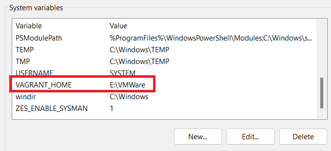
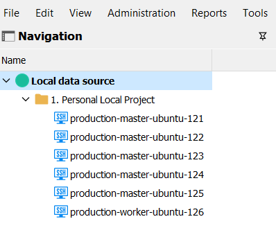

# Automate creating virtual machines for Lab practices 


## Overview

For on-premise and lab practice environment, this repo aims to use Vagrant to boot up virtual machines with configuration files.

### Supported platforms:

Currently, we are focusing on `VMWare`. But well-known platforms are considered to be developed at the future point of time.


| Platform | Supported? |
| :---: | :---: |
| VMware | :white_check_mark: |
| VirtualBox | :x: |
| Docker | :x: |
| Hyper-V | :x: |

## Get started

### Prerequisite

> **Recommend**: For WSL users, Vagrant should be installed on local machines, not inside WSL.

#### 1. Vagrant

For Vagrant setup, refer to [Vagrant Download](https://developer.hashicorp.com/vagrant/downloads)

Install the plugin specifically that suit your platform, for our case:


```powershell
vagrant plugin install vagrant-vmware-desktop
```

(Optional) Set the default VM box location, choose the most-free drive for your lab set up. Add/Modify the enviroment variable `VAGRANT_HOME`

<p align="center">
    
</p>

#### 2. VMWare Workstation Pro (Free)

Visit [VMWare Workstation Pro](https://blogs.vmware.com/workstation/2024/05/vmware-workstation-pro-now-available-free-for-personal-use.html) to download, then install it.

### Let's cook

This repo divides virtual machines into multiple groups for specific purpose. Go to each folder group to see the setup of the architecture:

[Kubernertes RKE2 Cluster](/kubernetes-rke2-cluster)
[Kubernertes Openshift Cluster](/kubernetes-rke2-cluster)

#### Manage session
To working with these machines with SSH or RDP ,... connection. I utilize [RDM (Free)](https://devolutions.net/remote-desktop-manager/download/) to manage connection. You can use **Moba Xterm** or whatever tools you like, but for me, this tool suit me best

Import [RDM file](rdm/all-in-one-session-manangement.rdm) to get started with. 

<p align="center">
    
</p>

- Recheck and edit the IP connection for each hosts.
- To change the credential for your connection, modify it at folder level.
