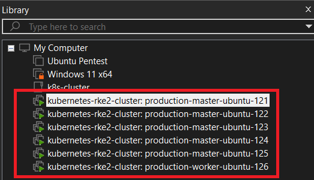

## Bootstrapping Architect

### Target

When I create this architecture, my solely purposes aim to:

- Test "Raft Consensus Algorithm" for Master nodes: Voting mechanism
- Install and try common services on this RKE cluster.

### Virtual machine Overview

| Name | CPU(cores) | RAM(GBs) | Disk(GBs) | OS |
| :---: | :---: | :---: | :---: | :---: |
| production-master-ubuntu-121 | 2 | 2048 | 25 | Ubuntu |
| production-master-ubuntu-122 | 2 | 2048 | 25 | Ubuntu |
| production-master-ubuntu-123 | 2 | 2048 | 25 | Ubuntu |
| production-master-ubuntu-124 | 2 | 2048 | 25 | Ubuntu |
| production-master-ubuntu-125 | 2 | 2048 | 25 | Ubuntu |
| production-worker-ubuntu-126 | 2 | 2048 | 25 | Ubuntu |

### Usage

- Choose the ip as you desire and modify it in both files `worker_ips.txt` and `master_ips.txt`. I suggest we use range IPs of `NAT` card for Internet connectivity. 
- To show available IPs of NAT interfaces to use. In VMWare Workstation, go to `Edit` -> `Virtual Network Editor` -> VMnetX (with Type 'NAT'). Verify "Subnet IPs" and "Subnet Mask".

Initialize all the VM with `VMWare` provider

```powershell
vagrant up --provider=vmware_desktop
```


<p align="center">
    
</p>

Stop using the VMs:

```powershell
vagrant halt
```


### Troubleshoot

- Common problem could be solved by restart the machine
- Read the log from Vagrant when booting up for more informations